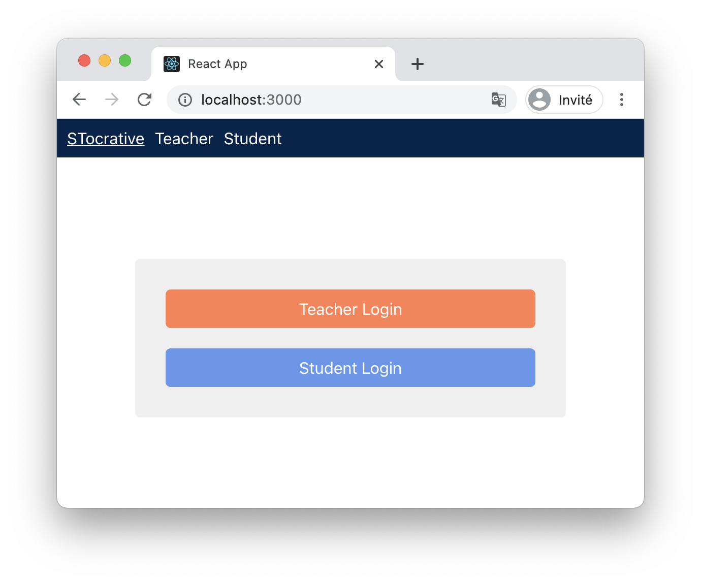

# Mise en forme CSS

## Menu

Déplacer le code :

```
<header className="host">
  <NavLink to="/" className="link" exact activeClassName="active">
    STocrative
  </NavLink>
  <NavLink to="/teacher" className="link" activeClassName="active">
    Teacher
  </NavLink>
  <NavLink to="/student" className="link" activeClassName="active">
    Student
  </NavLink>
</header>
```

Dans un composant `Menu.tsx` écrit sous forme de fonction.

Utiliser `<Menu />` à la place du header dans `App`.

Créer un fichier `Menu.css` et y déposer le code suivant :

```
.host {
  display: flex;
  background-color: #03234b;
  padding: 10px;
}

.link {
  color: white;
  text-decoration: none;
  margin-right: 10px;
}

.active {
  text-decoration: underline;
}
```

Renommer ensuite le fichier en `.module.css` et remplacer dans le JSX le nom des classes `host`, `link` et `active` par les classes générées (se servir de l'import comme vu pendant la formation).

## Home

Créer un JSX et un CSS au plus proche de cette mise en forme :



Les liens Teacher Login et Student Login utilisent le composant `Link` de `react-router-dom` pour faire des liens vers les pages correspondantes. 